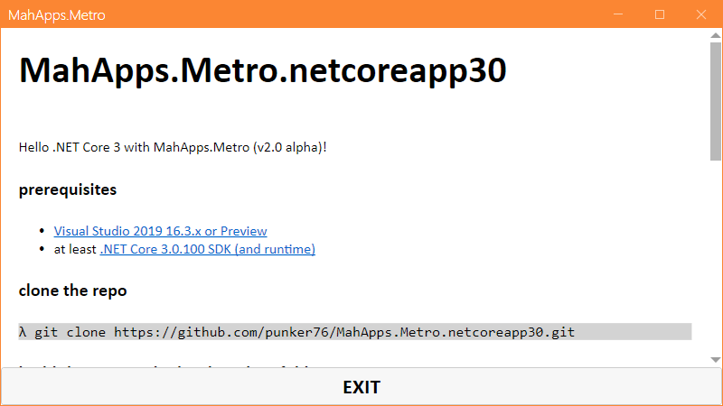

# MahApps.Metro.netcoreapp30
.NET Core 3.0 MahApps.Metro sample

clone the repo

```bash
λ git clone https://github.com/punker76/MahApps.Metro.netcoreapp30.git
```

build the app inside the cloned folder

```bash
λ dotnet build
```

run the app

```bash
λ dotnet run
```

<div align="center">



</div>
